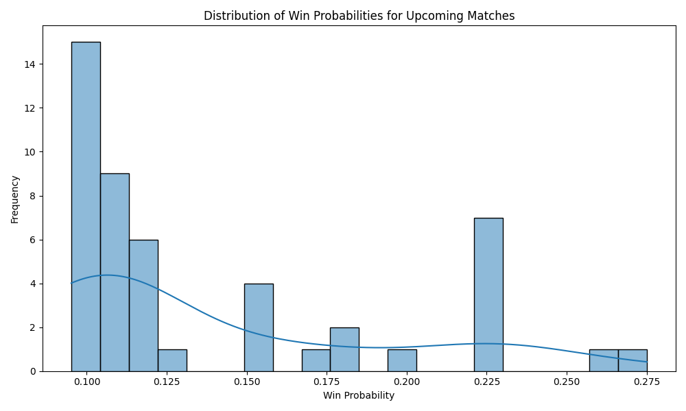

# Men’s Tennis Performance Analysis using Machine Learning

## Project Overview

This project aims to predict the match outcomes for Carlos Alcaraz in the year 2024 using historical tennis match data from 2020 to 2023. Advanced machine learning techniques are employed to forecast win probabilities for upcoming matches, providing valuable insights for coaches, analysts, and fans.

## Setup Instructions

### Virtual Environment Setup

To ensure that your project dependencies are managed properly and to avoid conflicts with other projects, it is recommended to use a virtual environment. Below are the steps to create, activate, and install the required dependencies.

#### 1. Clone the Repository

First, clone the repository to your local machine:

```bash
git clone https://github.com/jg2012/Capstone_Project
cd Capstone_Project


#### 2. Create a Virtual Environment
Create a virtual environment in the project directory. You can use venv for this purpose.

For Windows:
```bash
python -m venv venv
```

For macOS and Linux:
```bash
python3 -m venv venv
```

#### 3. Activate the Virtual Environment
To activate the virtual environment, run the following command:
For Windows:
```bash
venv\Scripts\activate
```

For macOS and Linux:
```bash
source venv/bin/activate
```

#### 4. Install Dependencies
Once the virtual environment is activated, install the project dependencies using pip:
```bash
pip install -r requirements.txt
```

#### Deactivate the Virtual Environment
When you are done working in the virtual environment, you can deactivate it by simply running:
```bash
deactivate
```

#### Additional Information 
To add new packages to the project, use pip install package-name and then update the requirements.txt file with the new dependencies:
```bash
pip freeze > requirements.txt
```

## Data Sources

Data for this project was gathered from multiple sources:
- **Sport Radar API**: Provides up-to-date player data, including current ATP and WTA rankings, player-specific stats, and match summaries.
- **Kaggle Dataset**: Historical match data from 2000 to 2023 was obtained from [Kaggle](https://www.kaggle.com/datasets/dissfya/atp-tennis-2000-2023daily-pull).

## Key Computational Resources

Several computational resources and tutorials were utilized in this project:
- Python libraries: `pandas`, `numpy`, `scikit-learn`, `matplotlib`, `seaborn`, and others.
- Jupyter Notebook for data analysis and visualization.
- GitHub for version control and collaboration.
- Overleaf for LaTeX report generation.

## Report and Documentation

The full project report, including detailed methodology, analysis, and results, can be accessed via Overleaf: [Project Report on Overleaf](https://www.overleaf.com/read/tgdwprqtzsfg#f298a3).

## Repository Contents

- **data/**: Contains the datasets used in this project.
  - `tennis_rankings.csv`
  - `tennis_rankings_modified.csv`
  - `tennis_competitor_profile.csv`
  - `tennis_competitor_profile_modified.csv`
  - `tennis_summaries.csv`
  - `atp_tennis.csv`
  - `atp_tennis_modified.csv`
  - `Alcaraz_C_matches_2020_2023_best_of_3.csv`
- **notebooks/**: Jupyter Notebooks used for data analysis and model training.
  - `ATP_notebook.ipynb`
- **scripts/**: Python scripts used for data processing and model training.
  - `data_collection.py`
  - `data_cleaning.py`
  - `model_training.py`
  - `visualizations.py`
- **img/**: Contains all the generated visualizations used in the report.
  - `Avg_Set_Score_Per_Year.png`
  - 
  - `Violin_Plot_of_each_Set.png`
  - 
  - `Win_and_Loss_Dist.png`
  - 
  - `win_probabilities.png`
  - 
  - `feature_importance.png`
  - 
  - `win_probability_distribution.png`
  - 
- **requirements.txt**: List of dependencies required to run the project.
- **README.md**: This file.

## Class Distribution and Model Performance

Class distribution before SMOTE:

Outcome
407573    50
352776     2
106755     2
23581      2
47603      2
89632      2
Name: count, dtype: Int64

Shape of X_preprocessed: (60, 9)

Shape of X_resampled: (300, 9)

Class distribution after SMOTE:

Outcome
407573    50
352776    50
106755    50
23581     50
47603     50
89632     50
Name: count, dtype: Int64

Shape of X_train: (210, 9), Shape of X_test: (90, 9)

Voting Ensemble Accuracy: 0.9555555555555556

Confusion Matrix:

[[17  0  0  0  0  0]
 [ 0 14  0  0  0  0]
 [ 0  0 16  0  0  0]
 [ 0  0  0 16  0  0]
 [ 0  0  0  0 11  0]
 [ 0  0  1  2  1 12]]

Classification Report:

              precision    recall  f1-score   support

     23581.0       1.00      1.00      1.00        17
     47603.0       1.00      1.00      1.00        14
     89632.0       0.94      1.00      0.97        16
    106755.0       0.89      1.00      0.94        16
    352776.0       0.92      1.00      0.96        11
    407573.0       1.00      0.75      0.86        16

    accuracy                           0.96        90
   macro avg       0.96      0.96      0.95        90
weighted avg       0.96      0.96      0.95        90

Shape of new_X before preprocessing: (48, 2)

Shape of new_X_scaled: (48, 9)

## Conclsion  

In this report, we successfully utilized historical data from 2020 to 2023 to predict Carlos Alcaraz's match outcomes for 2024. The ensemble model, combining logistic regression and random forest classifiers, demonstrated robust performance with an accuracy of 95.56 percent. The visualizations provided clear insights into the predicted win probabilities for upcoming matches. These findings offer valuable information for coaches, analysts, and fans, enhancing strategic decision-making for future matches.

## Future Work 

Future research should integrate additional performance metrics, such as player fatigue, weather conditions, and real-time match statistics, to improve the model's accuracy and robustness. Exploring more advanced models, like deep learning and reinforcement learning, could provide deeper insights and better predictions. Additionally, implementing real-time data feeds and continuous model updating will ensure the model remains relevant and accurate over time. Finally, expanding the analysis to include more players and matches will generalize the model's applicability across the sport.

## Result Interpretations 

The ensemble model achieved an accuracy of 95.56 percent, indicating a high level of performance. The model shows high precision and recall for predicting wins, with detailed classification reports provided for further insight. The confusion matrix suggests that the model is effective at predicting match outcomes, which is valuable for strategic decision-making.


